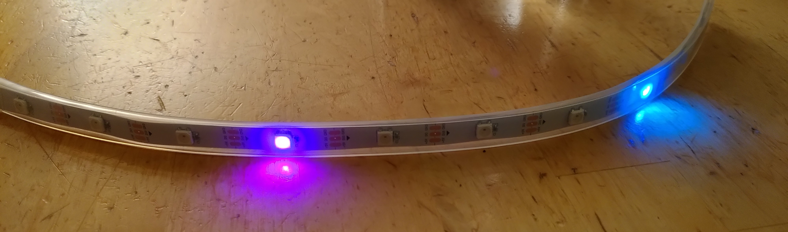
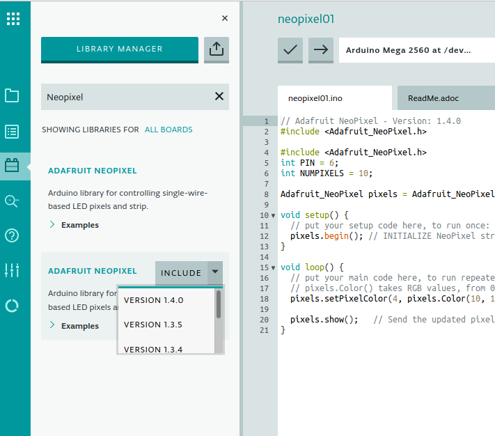

# Neopixel Farb-LED-Streifen

Folgende kurze Dokumentation enthält

* das Verbinden der Farb-LED-Streifen mit einem Arduino
* der Installation der Neopixel Biblothek sowohl für die Arduino Desktop IDE wie auch für den Web Editor
* kleineren Beispielprogrammen inkl. Lösungen

Letzte Änderung: 3.10.21, Erasmus Bieri

## (Weitere) Infos zur Neopixel-Bibliothek

* https://learn.adafruit.com/adafruit-neopixel-uberguide/arduino-library-use
* https://learn.adafruit.com/adafruit-neopixel-uberguide
* https://learn.adafruit.com/adafruit-neopixel-uberguide/best-practices


## Verbindung zum Arduino

* Der Betrieb mehrerer RGB-LED kann schnell mehr Strom ziehen, als wofür das am USB-Anschluss des Computers hängende Arduinoboard ausgelegt ist:
  
* **Arduinobuchse mit Netzgerät verbinden, welches auf 5V eingestellt ist.**
  
* **Drei** Anschlüsse:

  | Arduino                    | Neopixel-Streifen |
  | -------------------------- | ----------------- |
  | Vin (**NICHT** 5V)         | +5V (rote Litze)  |
  | digitaler Pin (hier Nr. 6) | Din               |
  | GND                        | GND               |


### Bemerkungen zum Wiring

(siehe auch https://learn.adafruit.com/adafruit-neopixel-uberguide/basic-connections)

* IMMER zuerst GND (-) mit den NeoPixels verbinden. In umgekehrter Reihenfolge die Verbindung lösen.
* (siehe Abb. oben) Bei Verwendung eines DC-Netzteil oder eine grossen Batterie, einen grossen Kondensator (1000 µF, 6.3V oder grösser) zwischen + und – schalten. (Anscheinend kann der anfängliche Stromanstieg die pixel zerstören)
* (siehe Abb. oben) Ein 300-600 Ohm Widerstand zwischen Mikrokontroller und dem Dateneingang der Neopixel schützt vor Spannungsspitzen auf der Datenleitung, welche das erste Pixel angreifen können. 
  Manche Produkte haben diesen Widerstand integriert, aber doppelt hält besser und stört nicht.

### Stromverbrauch

* Maximal ziehen die Neopixels 60 mA (wortst case Szenario)
* 10 Pixels ziehen maximal 0.6 A
* 64 Pixels ziehen maximal 3.8 A

## Bibliothek Neopixel installieren

(Siehe auch hier: https://learn.adafruit.com/adafruit-neopixel-uberguide/arduino-library-use )

- In der **Arduino Desktop IDE**:
  - Werkzeuge > Bibliotheken verwalten …
  - Nach "neopixel" suchen
  - Auf Adafruit Neo**Pixel** (nicht Neo**Matrix**) klicken und neuste Version installieren, in Bild unten ist Version 1.4.0 installiert:
    

- Im **Web Editor**:
  - Links auf Libraries > Search Libraries: "Neopixel" eingeben und Bibliothek installieren:
    
  - Auf der Webseite von Adafruit gibt analoge Infos: https://learn.adafruit.com/adafruit-neopixel-uberguide/arduino-library-installation

## Beispielprogramme

### Eine kleiner Funktionstest: strandtest

* Starte die Arduino IDE
* Wähle Menü (evtl. Englisch...): Datei > Beispiele > (nach unten scollen) >Adafruit_NeoPixel > strandtest

Nun sollte man sich an einer kleinen Lichtshow erfreuen können!


Im Folgenden einige erste Beispielprogramme, mit welchen wir die Grundfunktionen testen können.

Kommentare zu den Programmen befinden sich **direkt im Programmcode**. Und Antworten zu den Fragen [ganz am Ende dieses Dokuments](#lösungen-aufgaben-beispielprogramme).

### Programm 1: Ein grünes Pixel zum Leuchten bringen ...

* Link zur Programmdatei: [Neopixelstreifen01.ino](programme/Neopixelstreifen01/Neopixelstreifen01.ino)
* **Aufgabe:** (Die Lösungen finden sich ganz am [Ende](#lösungen-aufgaben-beispielprogramme) dieses Abschnittes)
  Ändere den Befehl `pixels.setPixelColor(3, pixels.Color(0, 10, 0));` so ab, dass:
  * die LED an der **2.** Position grün leuchtet.
  * die LED an der 2. Position **rot** leuchtet.
  * die LED an der 2. Position **gelb** (= rot und grün (!)) leuchtet.
  * die LED an der 2. Position **heller** gelb leuchtet.
  * Welche LED leuchtet, wenn die 0. Position ausgewählt wird?


### Programm 2: Mehrere Pixel zum Leuchten bringen ...

* Link zur Programmdatei: [Neopixelstreifen02.ino](programme/Neopixelstreifen02/Neopixelstreifen02.ino)
* **Aufgabe:** (Die Lösungen finden sich ganz am [Ende](#lösungen-aufgaben-beispielprogramme) dieses Abschnittes)
  * Wer wird mit der additiven RGB-Farbmischung herumspielen möchte: http://spectrumcolors.de/cor_rgb_demo.php
  * Wie mischt man Hellblau (= Cyan) oder Pink (= Magenta)?


### Programm 3: for-Schleife

* Link zur Programmdatei: [Neopixelstreifen03.ino](programme/Neopixelstreifen03/Neopixelstreifen03.ino)
* **Aufgabe:** (Die Lösungen finden sich ganz am [Ende](#lösungen-aufgaben-beispielprogramme) dieses Abschnittes)
  * Ändere das Programm so ab, dass das Lauflicht nicht nur in einer Richtung läuft, sondern hin- und her geht.


### Programm 4: Pulsierende LEDs

* Folgendes Programm führt zu pulsierenden Blinklichtern. Link zur Programmdatei: [Neopixelstreifen04a.ino](programme/Neopixelstreifen04a/Neopixelstreifen04a.ino)

Wir können es ein wenig abändern und ein pulsierendes Lauflicht programmieren. Dabei sollten die verschiedenen LEDs **zeitversetzt** pulsieren.
Eine Möglichkeit, die Variable i ein wenig zu verschieben, ist das Teilen mit Rest: 4 % 30 ist der ganzzahlige Rest, wenn man 4 durch 30 teilt: Dies ist 4. Somit ergibt 29 % 30 = 29 und 30 % 30 = 0 und 31 % 30 = 1...

Damit lässt sich ein pulsierendes Lauflicht programmieren: [Neopixelstreifen04b.ino](programme/Neopixelstreifen04b/Neopixelstreifen04b.ino)


### Programm 5: Zufallsfarbe

In folgendem Programm werden Farbe und Position zufällig ausgewählt. Link zur Programmdatei: [Neopixelstreifen05.ino](programme/Neopixelstreifen05/Neopixelstreifen05.ino)

**Aufgabe:**

1. Probiere aus, was passiert, wenn du die Grenze bei `if (randR < 15)` usw. von 15 auf 0 setzt (auch für randG und randB) ? Werden die Farben dann "pastellfarbener"?

### Lösungen Aufgaben Beispielprogramme
- Programm 1:
  1. `pixels.setPixelColor(2, pixels.Color(0, 10, 0));`
  2. `pixels.setPixelColor(2, pixels.Color(10, 0, 0));`
  3. `pixels.setPixelColor(2, pixels.Color(10, 10, 0));`
  4. `pixels.setPixelColor(2, pixels.Color(100, 100, 0));`
  5. Die erste LED! Wie oft in der Informatik ist der Index für das erste Element 0 und nicht 1 usw.
- Programm 2:
  1. --
  2. Hellblau/Cyan: Grün und Blau gleich stark.
  Pink/Magenta: Rot und Blau gleich stark.
- Programm 3:
  1. Nach der ersten for-Schleife (aber vor `pixels.clear();`) folgende zweite Schleife einfügen:
  ```c++
  for (int i = NUMPIXELS; i > 0; i--) {
    Serial.println(i);
    pixels.setPixelColor(i, pixels.Color(0, 30, 30));
    pixels.setPixelColor(i + 1, pixels.Color(0, 0, 0));
    pixels.show();
    delay(200);
  }
  ```

