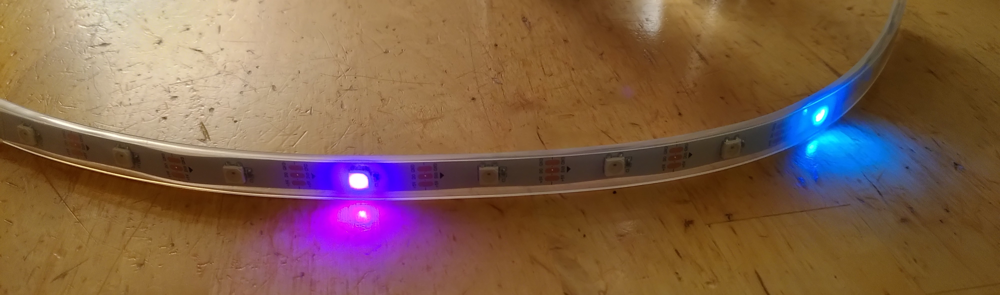
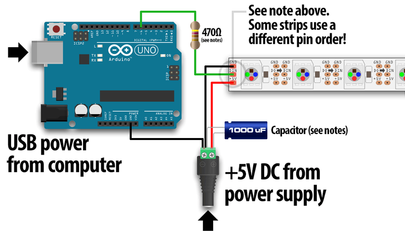
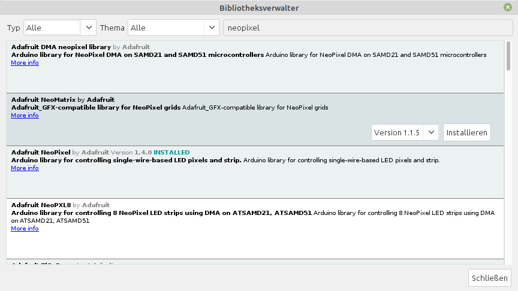

# Neopixel colour LED strips

The following short documentation contains

* how to connect the colour LED strips to an Arduino
* the installation of the Neopixel library for both the Arduino Desktop IDE and the Web Editor
* smaller example programs incl. solutions

Last change: 3.10.21, Erasmus Bieri

## (More) Info about the Neopixel library

* https://learn.adafruit.com/adafruit-neopixel-uberguide/arduino-library-use
* https://learn.adafruit.com/adafruit-neopixel-uberguide
* https://learn.adafruit.com/adafruit-neopixel-uberguide/best-practices


## Connection to the Arduino

* Operating multiple RGB LEDs can quickly draw more current than what the Arduino board hanging from the computer's USB port is rated for:
  
* **Connect Arduino socket to power supply set to 5V.
  
* **Three** connections:

  | Arduino                    | Neopixel-Stripes |
  | -------------------------- | ----------------- |
  | Vin (**NOT** 5V)         | +5V (red cable)  |
  | digital Pin (here Nr. 6) | Din               |
  | GND                        | GND               |



### Remarks on the Wiring

(see also https://learn.adafruit.com/adafruit-neopixel-uberguide/basic-connections)

* ALWAYS connect GND (-) to the NeoPixels first. Disconnect in reverse order.
* If using a DC power supply or a large battery, connect a large capacitor (1000 µF, 6.3V or larger) between + and -. (Apparently the initial current rise can destroy the pixel).
* A 300-600 Ohm resistor between the microcontroller and the data input of the neopixel protects against voltage spikes on the data line that can affect the first pixel. 
  Some products have this resistor built in, but double is better and does not interfere.

### Power consumption

* The Neopixels draw a maximum of 60 mA (worst-case scenario).
* 10 pixels draw a maximum of 0.6 A
* 64 pixels draw a maximum of 3.8 A

## Install the Neopixel library

(See also here: https://learn.adafruit.com/adafruit-neopixel-uberguide/arduino-library-use )

- In the **Arduino Desktop IDE**:
  - Tools > Manage Libraries ...
  - Search for "neopixel
  - Click on Adafruit Neo**Pixel** (not Neo**Matrix**) and install latest version, in picture below version 1.4.0 is installed:
    

- In the **Web Editor**:
  - Links to Libraries > Search Libraries: enter "Neopixel" and install library:
    
  - On the website of Adafruit there is analogue information: https://learn.adafruit.com/adafruit-neopixel-uberguide/arduino-library-installation

## Example programs

### A small function test: strandtest

* Start the Arduino IDE
* Select menu: File > Examples > (scroll down) >Adafruit_NeoPixel > strandtest

Now you should be able to enjoy a little light show!


Below are some first example programmes with which we can test the basic functions.

Comments to the programs are **directly in the program code**. And answers to the questions [at the very end of this document](#solutions-tasks-example-programmes).

### Programme 1: Make a green pixel glow ...

* Link to the programme file: [Neopixelstrip01.ino](programme/Neopixelstreifen01/Neopixelstreifen01.ino)
* **Task:** (The solutions can be found at the very [end](#solutions-tasks-example-programs) of this section)
  Modify the command `pixels.setPixelColor(3, pixels.Color(0, 10, 0));` so that:
  * the LED at the **2nd ** position is green.
  * the LED at the 2nd position lights **red**.
  * the LED at the 2nd position **yellow** (= red and green (!)) lights up.
  * the LED at the 2nd position **brighter** yellow lights.
  * Which LED lights up when the 0th position is selected?


### Programme 2: Make several pixels light up ...

* Link to the programme file: [Neopixelstrip02.ino](programme/Neopixelstreifen02/Neopixelstreifen02.ino)
* **Task:** (The solutions can be found at the very [end](#solutions-tasks-example-programmes) of this section).
  * If you want to play around with additive RGB colour mixing: http://spectrumcolors.de/cor_rgb_demo.php
  * How do you mix light blue (= cyan) or pink (= magenta)?


### Programme 3: for loop

* Link to the programme file: [Neopixelstreifen03.ino](programme/Neopixelstreifen03/Neopixelstreifen03.ino)
* **Task:** (The solutions can be found at the very [end](#solutions-tasks-example-programmes) of this section).
  * Modify the program so that the chaser does not run in only one direction, but goes back and forth.


### Programme 4: Pulsating LEDs

* The following programme results in pulsating flashing lights. Link to the programme file: [Neopixelstreifen04a.ino](programme/Neopixelstreifen04a/Neopixelstreifen04a.ino).

We can modify it a little and programme a pulsating chaser. In this case, the different LEDs should pulsate **time-delayed**.
One way to shift the variable i a little is to divide it with remainder: 4 % 30 is the integer remainder when you divide 4 by 30: This is 4. Thus 29 % 30 = 29 and 30 % 30 = 0 and 31 % 30 = 1....

This can be used to programme a pulsating chaser: [Neopixelstreifen04b.ino](programme/Neopixelstreifen04b/Neopixelstreifen04b.ino)


### Programme 5: Random Colour

In the following programme, colour and position are selected randomly. Link to the programme file: [Neopixelstrip05.ino](programme/Neopixelstrip05/Neopixelstrip05.ino)

**Task

1. try out what happens if you set the limit at `if (randR < 15)` etc. from 15 to 0 (also for randG and randB) ? Do the colours then become more "pastel" ?

### Solutions Tasks Sample programs
- Program 1:
  1. `pixels.setPixelColor(2, pixels.Color(0, 10, 0));`
  2. `pixels.setPixelColor(2, pixels.Color(10, 0, 0));`
  3. `pixels.setPixelColor(2, pixels.Color(10, 10, 0));`
  4. `pixels.setPixelColor(2, pixels.Color(100, 100, 0));`
  5. The first LED! How often in computer science is the index for the first element 0 and not 1 etc.
- Programm 2:
  1. --
  2. Light blue/cyan: Green and blue of equal strength.
  Pink/Magenta: Red and blue of equal strength.
- Programme 3:
  1. after the first for loop (but before `pixels.clear();`) insert the following second loop:
  ```c++
  for (int i = NUMPIXELS; i > 0; i--) {
    Serial.println(i);
    pixels.setPixelColor(i, pixels.Color(0, 30, 30));
    pixels.setPixelColor(i + 1, pixels.Color(0, 0, 0));
    pixels.show();
    delay(200);
  }
  ```

